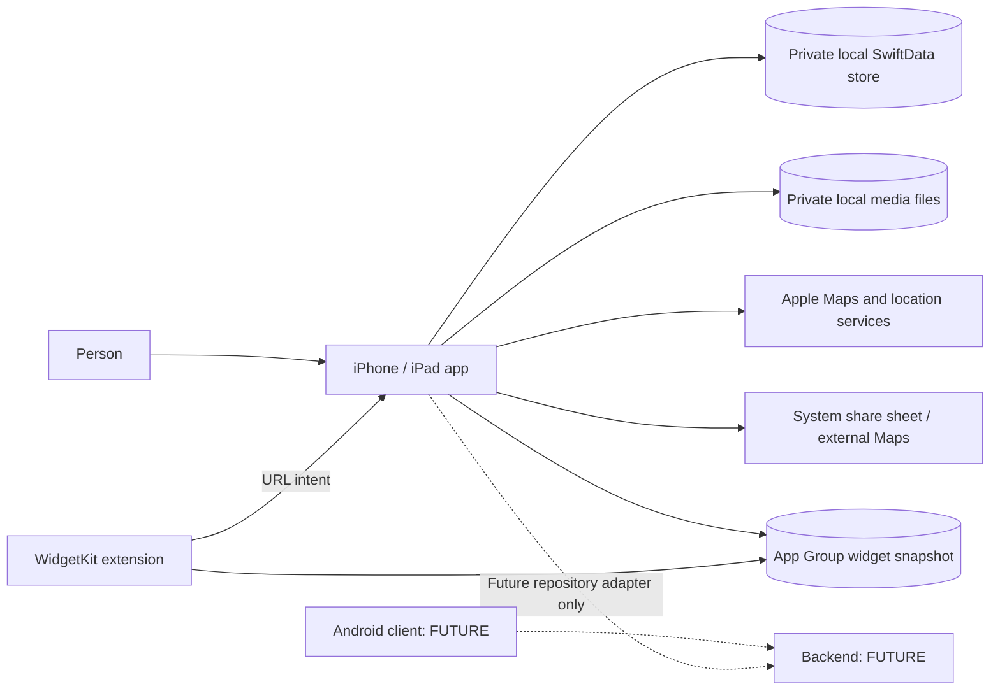
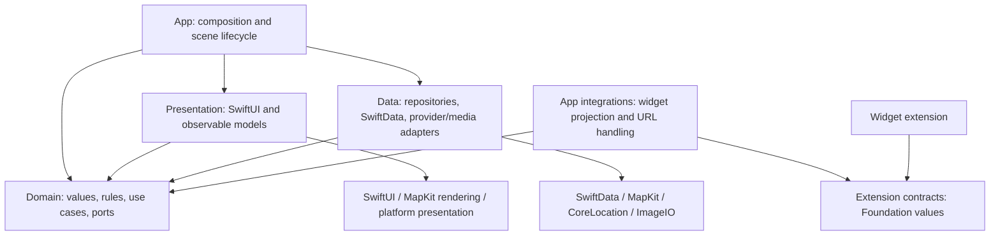

# System and iOS architecture

## Context and future platforms



Solid arrows are current-release boundaries. Dashed arrows are placeholders with no runtime dependency. MapKit is an external Apple service dependency even though ProjectAlpha has no application backend. Local storage is the authoritative source for saved user data.

Future Android should reuse product rules and behavioral tests conceptually, with native presentation, persistence and maps adapters. Kotlin/Compose/Room are candidates, not committed dependencies or version requirements. No shared Swift UI/runtime or cross-platform framework is prescribed.

Future backend responsibilities may include identity, authorization, account ownership, synchronization, remote assets, collaboration and universal-link landing pages. Provider, API shape, hosting and conflict policy are undecided. A later design must address server revisioning, offline conflicts, deletion, account switching, local-data adoption and cross-provider place identity before implementation.

## Clean Architecture dependency rule



Arrows denote compile-time dependencies. Domain does **not** depend on Data. A runtime call from a use case to a repository implementation occurs through a Domain-owned protocol, not a Domain import of Data.

| Layer | Owns | Must not own |
|---|---|---|
| Domain | Collection/Location values, coordinates, place identity, validation, duplicate policy, repository/service protocols, use cases | SwiftUI views, MapKit/CoreLocation/SwiftData types, Combine publishers, localized UI strings, global settings |
| Data | SwiftData models/mappers/store actor, repositories, Apple place/location adapters, media persistence | Tab selection, sheets, widgets' UI, screen copy |
| Presentation | Feature state, drafts, navigation requests, SwiftUI, MapKit camera/rendering adapters, localization, adaptive containers and input/accessibility semantics | Direct SwiftData mutations, file deletion, SQL/network DTOs, business identity rules, device-model layout policy |
| App | Manual DI, shared service lifetime, scene bootstrap, integration wiring | Business validation hidden in view factories |
| Extension contracts | Versioned snapshot DTOs and URL intent encoding/parsing | App container, SwiftData models, UIKit-dependent helpers |

Foundation-only shared utilities can be reused by Domain when needed, but a broad `Shared/` folder is not a dependency layer. Put UI formatting in Presentation and SDK conversions in adapters. A naming convention must not hide platform dependencies inside Domain values.

## Suggested repository and iOS layout

```text
project-alpha/
  docs/                              # This specification
  ios/ProjectAlpha/
    ProjectAlpha/
      App/
        DI/                          # AppContainer + feature factories
        Bootstrap/                   # Library readiness and recoverable startup
        Integrations/                # WidgetSnapshotPublisher, external-intent ingress
      Domain/
        Entities/                    # Foundation value types
        Policies/                    # Validation and DuplicatePlacePolicy
        Repositories/                # Contracts only
        Services/                    # Place/location/media ports
        UseCases/                    # Operations, not trivial UI setters
      Data/
        Persistence/                 # SchemaV1, migration plan, LibraryStore actor
        Repositories/
        Mappers/
        Services/                    # AppleMaps, device location, media
      Presentation/
        Routing/                     # SceneCoordinator, typed routes, RouterView
        Adaptive/                    # Available-space presentation policy, if shared policy is justified
        Features/
          Home/ CollectionDetail/ CollectionMap/ Map/
          PlaceSearch/ LocationDetail/ LocationEditor/ CollectionEditor/ Settings/
        Components/                  # Shared MapCanvas/detail content
        DesignSystem/                # Thin tokens and reusable domain UI
        Localization/
      Resources/
    ProjectAlphaContracts/           # App + widget membership; no app-only imports
    ProjectAlphaWidget/              # WidgetKit target
    ProjectAlphaTests/
    ProjectAlphaUITests/
  android/                           # FUTURE; no scaffold required by this task
  backend/                           # FUTURE; no scaffold required by this task
```

Keep the existing Xcode project and Home/Map/Settings containers. The layout is a target organization, not permission to rewrite unrelated source or discard user work. Start with folder boundaries in the app target and a small extension-safe shared target/group; extracting everything into packages is unnecessary. A future Domain package can enforce import boundaries if scale justifies it.

## Ownership and DI

`AppContainer` owns one persistent `ModelContainer`, one `LibraryStore` actor, repository implementations, preference store, a device-location broker and the widget publisher. Feature containers receive these dependencies; they must not each instantiate storage or a mutable search completer.

Every `AppRootView`/scene owns its `SceneCoordinator` and independent tab routers. MainTabView uses this coordinator rather than keeping an inaccessible `selectedTab` that external intents cannot change. Each pushed Collection Map gets its own map session. Global Map's session is retained during tab switches.

Views that own reference presentation state retain an injected `@Observable @MainActor` model with `@State`; child views receive the reference and use `@Bindable` only when binding is needed. Stable destination identity prevents a new model from replacing an active editor. Factories may run during view construction, so initializers must be cheap and side-effect-free. Start/cancel observation and loading through explicit lifecycle methods or `.task(id:)`, not constructor-launched unstructured work. Do not claim Apple prohibits constructing observable state in a view; the requirement is correct ownership and identity.

Constructor injection is the default. Use Environment for scene-wide routing/preferences and narrowly scoped UI services, not as a global service locator accessed by all business code.

## Adaptive presentation boundary

Adaptive presentation is a Presentation concern layered over stable scene and feature state. `SceneCoordinator` and feature models own route, selection, map session, search and draft identity; a view chooses stack, split, adjacent, inspector, sheet or popover from current available space without creating a second owner. The same IDs and models cross layout transitions. No persistence, Domain policy or route value records a device family, interface orientation or a particular compact/regular rendering.

Use the standard SwiftUI navigation, tab/sidebar, toolbar and presentation containers so the system can respond to iPad window resizing and iPhone Duo displays, folds and vertical bars. Treat size classes and scene geometry as inputs local to the presented scene. Do not use device-model checks, interface idiom, orientation, `UIScreen.main` or fixed screen breakpoints as architecture. When custom geometry is unavoidable, consume each safe-area inset independently and use only SDK-declared reserved-region/arrangement APIs whose availability has been verified and compiled against the selected SDK.

Input and accessibility are part of the component contract rather than a later skin. Shared UI components expose semantic actions for touch, keyboard and pointer; preserve native focus, hover and scanning behavior; support VoiceOver, Voice Control and Switch Control; meet the 44-by-44-point minimum custom target; and respond to Dynamic Type, RTL, Reduce Motion and Reduce Transparency. Widget views follow the same semantic and layout principles within WidgetKit's family/content-margin contract.

## Persistence and concurrency

Use a single `@ModelActor`-based `LibraryStore` as the serialization boundary for persistent reads and writes. It holds its own ModelContext; disable autosave for draft/transaction control. No `@Model` object or ModelContext escapes the actor. Return immutable `Sendable` domain values and query results.

Each write method does all database reads, validation, duplicate checking, mutation, save and commit revision update without `await` between them. Actor isolation alone is not sufficient if a method suspends in the middle of check-and-insert. Provider requests and image processing finish before this critical section; freshness is rechecked inside it. Explicitly roll back pending context changes on failure. [Apple ModelActor](https://developer.apple.com/documentation/swiftdata/modelactor), [ModelContext](https://developer.apple.com/documentation/swiftdata/modelcontext)

The app target currently defaults to MainActor isolation. Make actor/value boundaries explicit; Domain values/protocols must not accidentally acquire UI isolation through a build setting. Use SDK-supported `nonisolated` declarations or a nonisolated Domain target as appropriate. Do not silence diagnostics with `@unchecked Sendable` or `nonisolated(unsafe)` around models/contexts. Verify the store's executor under the installed toolchain; an actor is not itself a guarantee that expensive work is on a background thread.

Image decoding/resizing and snapshot encoding run outside the main UI actor. MainActor presentation receives only UI-ready state. Provider search adapters own their SDK objects in the isolation domain required by those APIs. Each concurrent search session has separate request state and cancellation; a singleton continuation slot must not serve two screens.

## Change propagation across tabs and widgets

Successful commits advance a durable monotonically increasing library revision in `LibraryMetadataLocal`. Repository observation provides an initial query result and then results/invalidation revisions for committed changes. Registration and the initial fetch must be race-free; each observer has its own stream, cancellation and termination cleanup. Never share a single consuming AsyncStream iterator among screens.

Feature models observe their relevant queries. Collection counts, locations, favorites, search caches and selections update even when another tab performs the write. Coalesce bursts and use the revision to reject stale refresh completions. Inactive screens may stop expensive observation, but must compare revision and reload on activation. Camera/detail state remains local to a map session and does not reset on every data event.

The widget publisher subscribes once at the integration boundary. It reads a consistent snapshot from the store and publishes the highest committed revision. Views do not call `refreshWidgetSnapshot()` after each button press. Foreground/startup also reconciles snapshots after interruption.

Performance and footprint are cross-cutting design constraints (U-31, D-20). Keep feature initialization cheap, avoid repeated per-row fetches or eager full-size image decoding, and measure any added startup, query, rendering, media or extension cost on representative workloads. Maintain correctness and the existing ownership boundaries while moving expensive work away from the main actor. Review app and extension resources and dependencies for their contribution to build and installed size; record comparable release measurements rather than asserting an unmeasured size target.

## Use-case and port boundaries

| Operation | Domain responsibility | Data/integration responsibility |
|---|---|---|
| BootstrapLibrary | Exactly one protected default collection | Serialized bootstrap and schema open |
| ObserveCollections / ObserveLocations | Query scope and result contract | Consistent fetch plus revision-aware stream |
| Create/Update/DeleteCollection | Validation and protected-default policy | Atomic writes/cascade, media cleanup scheduling |
| SaveLocation / MoveLocation | Draft validation and duplicate policy | Recheck policy against live data and commit atomically |
| SetFavorite / DeleteLocation | Intent-specific mutation | Patch latest record; advance revision |
| SearchSavedLocations | Scoped matching | Query latest local data; no stale lifetime cache |
| Suggest/ResolvePlace | Domain suggestion/candidate contract | MapKit resolution and error mapping |
| GetCurrentPosition / EstimateRoute | Permission/result contracts and transport choice | CoreLocation/MapKit |
| Stage/DiscardMedia | Stable draft asset contract | Local files, downsampling and orphan recovery |
| PublishWidgetSnapshot | Not a Domain use case | App integration projects committed domain state |

Protocols should enable a real boundary or testing seam. Do not require a protocol for every helper or a generic base ViewModel/repository. Use typed errors, including validation, duplicate, destination missing, edit conflict, storage unavailable and provider unavailable; translate them into UI copy in Presentation.

## Test seams and simplicity

Inject repositories, a clock/ID generator where deterministic behavior needs them, place/location adapters, media storage and widget writer/reloader. Use in-memory SwiftData for integration tests and temporary directories for files. Keep Foundation values deterministic so duplicate/navigation tests do not need MapKit or a simulator.

An app with no backend does not need a networking layer, sync worker, remote DTOs or durable outbox. Schema versioning and repository ports provide appropriate future extension points. They do not require implementation of a speculative server.
