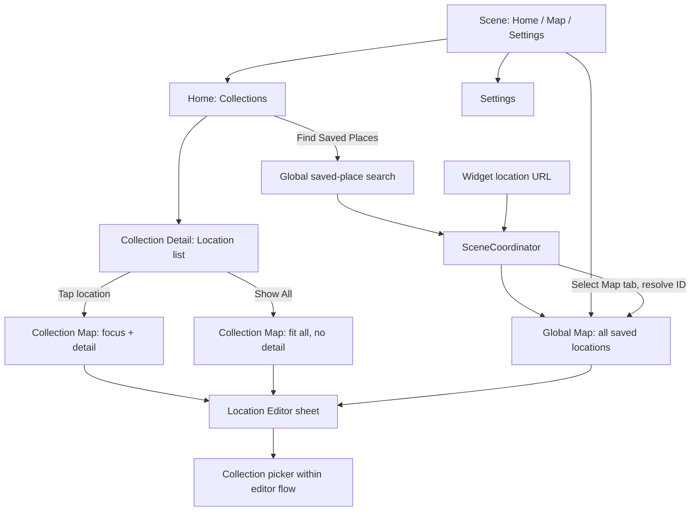
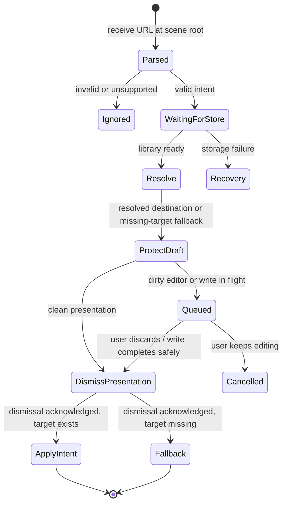

# Navigation, deep links and restoration

## Navigation model



Home, Map and Settings remain exactly three top-level destinations. On compact available width, use one navigation stack per destination. At wider sizes, let the system adapt the tab presentation to a sidebar and use `NavigationSplitView` or another standard split/adjacent presentation where the content hierarchy benefits. Keep separate Home/Map/Settings route types and one logical route graph: a column becoming visible or collapsing must not invent a competing navigation path or reset the selected destination.

Conceptual route values (not copy-ready implementation):

```swift
enum HomeRoute: Hashable, Codable {
    case collection(id: UUID)
    case collectionMap(collectionID: UUID, entry: CollectionMapEntry)
}

enum CollectionMapEntry: Hashable, Codable {
    case all
    case location(id: UUID)
}

enum SettingsRoute: Hashable, Codable {
    case language
}
```

Tab roots do not have to be elements of a path. The existing `root` property may remain if useful. Global Map selection is its session state, not a pushed HomeRoute. Do not force an unused wrapper Route enum across all tabs merely because the scaffold has one.

Route values carry IDs and entry intent; they never carry a saved entity snapshot, closure, View, ViewModel, ModelContext or MapKit object. The selected location can change after entry without rewriting the path. SwiftUI supports programmatic paths for deep links and restoration. [Apple navigation guidance](https://developer.apple.com/documentation/swiftui/understanding-the-navigation-stack)

When Home opens a collection, it may supply the tapped name as a scene-local title hint outside the route value. This lets Collection Detail render its navigation title on its first displayed frame while loading the current record by ID. The loaded name replaces a stale hint; deleted or unrestorable IDs use the missing-entity path. Deep links/restoration carry only IDs and must resolve current data before presenting an authoritative title.

## SceneCoordinator responsibilities

The coordinator owns selected tab, the three routers, modal ownership, pending external intent and navigation restoration. It references map-session presentation models through narrow interfaces. It does not own every form field or implement repository operations itself.

| Event | Result |
|---|---|
| Select Collection | Push its ID-based list in Home and provide the tapped name as an immediate scene-local title hint |
| Find Saved Places | Preserve Home path/filter; select Map tab and present Global Map search with `All Saved Places` scope |
| Select list Location | Push/activate that collection's map, focus ID and open detail |
| Show All | Push/activate that collection's map and issue fit-all camera intent |
| Back from Collection Map | Close map presentation and pop to list, preserving list query/scroll |
| Select another tab | Keep each tab's path and camera/session state |
| Widget Location | Select global Map, resolve latest record, focus and open detail |
| Selected Location deleted | Clear detail/selection, keep camera, show unavailable message if triggered externally |
| Scope Collection deleted | Trim Home path to nearest valid ancestor; typically Home |
| Selected Location moved | Collection Map removes selection if out of scope; Global Map keeps selection |

Hide the current top-level tab/sidebar chrome only while Collection Map is the visible Home destination. Restore it when returning to the list. Global Map does not explicitly hide top-level navigation. Native modal sheets can temporarily cover underlying controls; Close remains available so users can return to top-level navigation. Do not draw a second custom tab bar or sidebar on top of a system presentation.

## Modal ownership

Use an explicit enum/session for mutually exclusive map presentation states: none, detail, search or editor. Read-only detail may adapt to an adjacent panel/inspector whenever available space supports it, including iPad and the open iPhone Duo. A form flow may own an internal navigation stack for collection selection/new collection, avoiding a chain of sheet booleans. Prefer columns, inspectors and anchored popovers over blocking modal chains on iPad when they preserve context and match the hierarchy; compact adaptation may use a sheet without changing ownership.

Opening Search suspends detail presentation but remembers selection. Cancelling Search restores prior selection/detail. Choosing a result replaces selection. Home's Find Saved Places action uses this same Global Map search presentation; dismissing it does not modify Home's path/filter. Opening an editor suspends read-only detail; Save/Cancel restores the appropriate map session after the editor dismisses. Photo viewer/system share/camera is a child of the currently active presentation and must be dismissed before an unrelated external route is applied.

Only one presentation transition is in flight per scene. Drive follow-up transitions from actual dismissal completion (`onDismiss` or equivalent state acknowledgement), not an arbitrary sleep or `Task.yield()` used as a timing guarantee.

## Location-creation ownership

One stable `LocationDraft` belongs to the active creation flow. Candidate detail displays its destination and can commit quick capture directly; `Add Details`, destination picker and place selection all edit that same draft. Selecting a place while already inside a new-location editor fills the existing draft instead of presenting another editor. Replacing a candidate that would discard entered fields requires Keep Editing / Replace Place.

| Entry owner | Successful in-scope save | Successful out-of-scope save | Cancel |
|---|---|---|---|
| Collection Detail | Pop the creation presentation; refresh list/count and preserve query/scroll | Same return; confirmation names destination and offers View in Global Map | Return to the list and preserve state |
| Collection Map | Select committed record and focus when appropriate | Retain scope/camera; present committed receipt with explicit Open Saved Place | Restore previous selection/detail |
| Global Map | Select committed record globally | Not applicable because every collection is in scope | Restore previous selection/detail |

A committed receipt carries the saved UUID, destination ID and committed revision separately from the original candidate. It must not expose Save as though the completed operation were still pending. Opening its record re-resolves latest data and follows normal dirty-draft protection.

## External-intent contract

Working scheme: `projectalpha`; host/version: `v1`. This is the design contract for the independent app, not a claim it is registered already. Centralize the scheme in app/extension configuration and register it with the target before testing.

| URL pattern | Intent |
|---|---|
| `projectalpha://v1/home` | Open Home root |
| `projectalpha://v1/collections/{collectionUUID}` | Open Home → Collection Detail |
| `projectalpha://v1/map` | Open Global Map, retaining valid session camera/selection |
| `projectalpha://v1/map/location/{locationUUID}?source=widget-favorites` | Open Global Map and select the current saved record |
| `projectalpha://v1/map/location/{locationUUID}?source=widget-collection&collectionID={collectionUUID}` | Same destination; collectionID is context/diagnostic hint, not record authority |

`source` and `collectionID` are optional metadata. Missing or unrecognized source must not prevent a valid location ID from opening. Parser accepts known path shapes and UUIDs, rejects malformed/duplicate known query keys, extra path components, unsupported versions and inputs exceeding 8,192 UTF-8 bytes. Reject user-info, ports and fragments; they are not part of this contract. Ignore unknown query keys for forward compatibility. Use URLComponents; do not hand-concatenate unescaped user text.

The custom scheme is an entry point, not authentication. It only navigates; it cannot create/delete data, resolve file paths, run arbitrary commands or import untrusted entities. Universal Links are FUTURE because no ProjectAlpha web domain/association contract has been selected.

## Deep-link state machine



1. Receive at scene root using the system URL lifecycle; do not attach the only handler to a conditional Home screen.
2. Parse to a Foundation intent. Wait for bootstrap; keep the latest queued navigation intent while bootstrapping.
3. Fetch the latest Location by UUID. Provider identity and widget cached collection name are not substitutes for the local UUID.
4. If an editor is dirty, show Keep Editing / Discard Changes. Keep Editing cancels the intent. Discard performs draft cleanup, waits for dismissal, re-resolves the target, then navigates. Do not silently save a draft. If a commit is already in flight, wait for its result before deciding.
5. Dismiss clean presentations using their lifecycle, then select Map and update Global Map's selection/camera/detail. Leave Home's path/session intact.
6. Recheck target validity when applying the intent because data may change while a dialog is open.
7. Use an intent-generation token: a slower earlier fetch cannot overwrite a newer requested destination. Repeated delivery of the same intent should focus once without growing a path.

Malformed URLs leave current UI unchanged. A missing location from a valid URL opens Global Map with no selected detail and a localized unavailable message, after respecting dirty-draft protection. A storage failure shows recovery and retains the pending intent for retry; it is not a "location deleted" result.

A location moved to a different collection still opens by its current UUID. A favorite removed after widget rendering still opens if the location exists. Widget navigation resolves the current record rather than trusting stale projected attributes. Refresh stale widget data afterwards.

## Adaptive iPad, iPhone Duo and scene behavior

Navigation and drafts belong to a scene, never an app-global singleton. Shared persistence changes propagate to every active scene. A URL is consumed by the scene chosen by the system; other scenes do not all navigate in response. No new-window command is in v1 scope.

Choose navigation and presentation from the scene's available space, horizontal/vertical size classes and local geometry. Never branch from device model, interface idiom, interface orientation, `UIScreen.main` or fixed screen-width breakpoints. On iPad, verify full, half, third, quadrant and floating/resized windows. On iPhone Duo, verify outer and inner displays, open/closed/partially folded poses, side-by-side multitasking and the vertical resizing caused by relevant Picture-in-Picture layouts.

On resize or pose change, detail can move between a sheet and adjacent panel and navigation columns can expand/collapse without changing route, selected Location, map scope/camera/search or any active draft/staged media. Use one detail content model and one selected ID; do not retain duplicate compact and regular presentation owners. Back/Close behavior and all functions remain equivalent with touch, keyboard, trackpad/pointer, VoiceOver, Voice Control and Switch Control.

Use system navigation, tab/sidebar and toolbar containers. Standard bars may move from horizontal to vertical on iPhone Duo. Give actions concise labels, preserve a clear primary-action order, assign visibility priority where the SDK supports it, and keep lower-priority actions usable through system overflow instead of clipping or removing them. Foreground controls honor each safe-area inset independently, asymmetric margins and SDK-exposed reserved regions. Do not place custom interactive controls in a fold/curve or camera region; standard components are preferred because the system can move sheets, alerts, menus and bars away from those regions.

## Restoration

Use a versioned Codable scene-navigation snapshot for selected tab, valid Home/Settings paths, saved selection IDs and last camera geometry per map session. Persist compact values, not whole entity arrays. Scope to scene identity and debounce writes.

Restore after bootstrap, validating each ID against storage. Prune missing descendants, clear invalid selections and show a valid ancestor; do not recreate deleted collections. Restore global and collection cameras independently. A new deep link supersedes stale restoration work.

Do not restore an open camera/share sheet, unresolved provider suggestion, confirmation dialog or unfinished editor UI. Local staged media is reconciled by draft recovery; v1 does not promise automatic form recovery after process termination. Language changes must not force root `.id(...)` replacement that destroys active navigation/drafts.
